## Machine learning

```python
import warnings
warnings.filterwarnings('ignore')

# Add all necessary imports here
import matplotlib.pyplot as plt
import pandas as pd
import numpy as np
import random

import math
from numpy.random import *
import seaborn as sns
from sklearn.metrics import classification_report, roc_curve, auc
from sklearn.model_selection import train_test_split, GridSearchCV,  RandomizedSearchCV
from sklearn import linear_model, datasets, decomposition
from sklearn.linear_model import LogisticRegressionCV, LinearRegression, LogisticRegression
from sklearn.svm.classes import SVC, OneClassSVM
from sklearn.cross_validation import KFold
from sklearn.decomposition import PCA
from sklearn.manifold import TSNE, Isomap
from sklearn.pipeline import Pipeline
from sklearn.model_selection import cross_val_score
from sklearn.preprocessing import PolynomialFeatures, StandardScaler, KernelCenterer
from matplotlib.ticker import LinearLocator, FormatStrFormatter
from sklearn import tree
from sklearn.ensemble import RandomForestClassifier
from sklearn.metrics import roc_auc_score, accuracy_score
from sklearn.model_selection import learning_curve
from sklearn.model_selection import ShuffleSplit
from sklearn.neural_network import MLPClassifier
from matplotlib import cm
from mpl_toolkits.mplot3d import Axes3D

import graphviz

%matplotlib inline
plt.style.reload_library()
plt.style.use("ggplot")
pd.options.display.float_format = '{:,.2f}'.format
np.set_printoptions(precision=3)
np.random.seed(42)
```

    /Users/stas/anaconda3/envs/mspell/lib/python3.6/site-packages/sklearn/cross_validation.py:41: DeprecationWarning: This module was deprecated in version 0.18 in favor of the model_selection module into which all the refactored classes and functions are moved. Also note that the interface of the new CV iterators are different from that of this module. This module will be removed in 0.20.
      "This module will be removed in 0.20.", DeprecationWarning)


```python
def plot_surface(est, x_1, x_2, ax=None, threshold=0.0, contourf=False):
    xx1, xx2 = np.meshgrid(np.linspace(x_1.min(), x_1.max(), 100), 
                           np.linspace(x_2.min(), x_2.max(), 100))
    X_pred = np.c_[xx1.ravel(), xx2.ravel()]
    if hasattr(est, 'predict_proba'):
        pred = est.predict_proba(X_pred)[:, 1]
    else:
        pred = est.predict(X_pred)
    Z = pred.reshape((100, 100))
    if ax is None:
        ax = plt.gca()

    if contourf:
        ax.contourf(xx1, xx2, Z, levels=np.linspace(0, 1.0, 10), cmap=plt.cm.coolwarm, alpha=0.6)
    ax.contour(xx1, xx2, Z, levels=[threshold], colors='grey')
    ax.set_xlim((x_1.min(), x_1.max()))
    ax.set_ylim((x_2.min(), x_2.max()))
    
    
    
def plot_data(x, y, model=None, label_x="x", label_y="y"):
    fig = plt.figure(figsize=(10,6))
    ax = fig.add_subplot(1, 1, 1)

    x0 = x.ix[:,0]
    x1 = x.ix[:,1]
    
    left = plt.scatter(x0[y==1], x1[y==1], color='r', marker='o')
    stayed = plt.scatter(x0[y==0], x1[y==0], color='g', marker='o')
            
    plt.xlabel(label_x)
    plt.ylabel(label_y)

    if model:
        plot_surface(model, x0, x1, threshold=0.5, contourf=True)
        
    plt.show()
```

## Regression


```python
n = 50
x = np.linspace(10, 100, n)
t = x * 2
noise = 40 * np.random.rand(n) - 20
y = t + noise
solutions = np.random.rand(3) * 1.3 + 1
```


```python
plt.scatter(x, y, color='b')
plt.xlabel('Input data')
plt.ylabel('Output data');
```


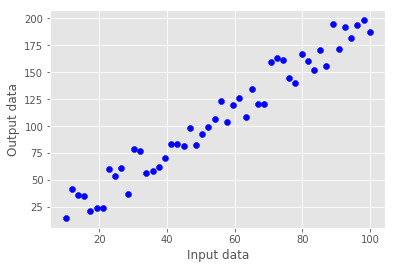


```python
for s in solutions:
    plt.plot(x, s * x, color='grey')

plt.scatter(x, y, color='b')
plt.xlabel('Input data')
plt.ylabel('Output data');
```


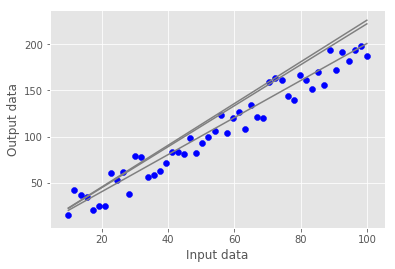


## We need to measure an error

So we will be able to compare models by how well they fit a data.


```python
class MeanSquareError:
    def calc(self, x, y, p):
        # error = (y - px)^2
        return np.mean((y - p * x)**2) 
```


```python
class MeanSquareError:
    def calc(self, x, y, p):
        # error = (y - px)^2
        return np.mean((y - p * x)**2) 
    
    def der(self, x, y, p):
        # d(error)/dp = -2x(y - px)
        return np.mean(-2.* x * (y - p * x))
    
    def der2(self, x, y, p):
        # d^2(error)/dp^2 = 2x^2
        return np.mean(2*x**2)
```


```python
class NewtonOptimizer():
    def __init__(self, err):
        self.err = err
    
    def optimize(self, x, y):
        p = 1
        while True:
            next_p = p - self.err.der(x, y, p) / self.err.der2(x, y, p)
            if abs(p - next_p) < 1e-4:
                return p
            p = next_p
```


```python
mse = MeanSquareError()
optimizer = NewtonOptimizer(mse)
optimal_p = optimizer.optimize(x, y)

plt.scatter(x, y, color='b')
plt.plot(x, optimal_p * x, color='k');
```


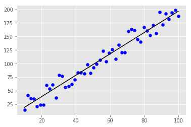


```python
x_vec = x.reshape(len(x), 1)
regression = LinearRegression()
regression.fit(x_vec, y)

plt.scatter(x, y, color='b')
plt.plot(x, regression.predict(x_vec), color='k')
plt.xlabel('Input data'); plt.ylabel('Output data')
print(f'F(x) = {regression.coef_[0]:.2f} * x');
```

    F(x) = 1.97 * x


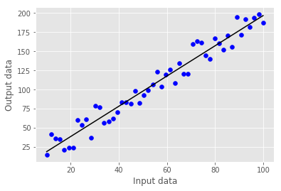


### Algorithm

* Initialize parameter(s) with some random state (p = 42)
* Calculate an error/cost for a function with this parameter
* Change parameter, so error/cost will decrease 
* Repeat until error/cost stop decreasing

### Minimizing an error function


### Classification


```python
n = 400
x1 = np.random.rand(n) * 200 - 100
x2 = np.random.rand(n) * 200 - 100
x = pd.DataFrame()
x['x1'] = x1
x['x2'] = x2
y = (x1+x2 + 50 * np.random.rand(n) - 25) > 0
```


```python
plot_data(x, y)
```


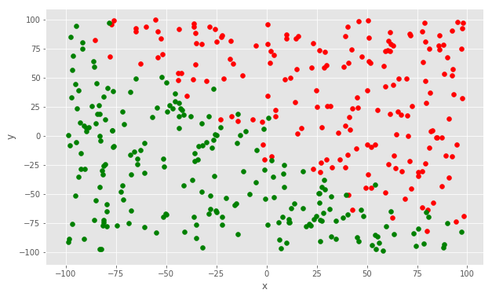


### Using regression for classification

* Using the same approach from optimization
* Different error measure
* Map output of regression into probability: [0,1]


```python
train, test, train_y, test_y = train_test_split(x, y, test_size=0.2)
regression = LogisticRegression()
regression.fit(train, train_y);
plot_data(train, train_y, regression)
```


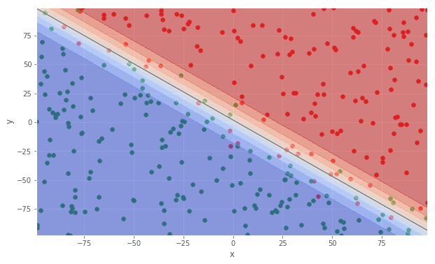


### What if data is not easly separable?


```python
n = 400
x1 = np.random.rand(n) * 200 - 100
x2 = np.random.rand(n) * 200 - 100
x = pd.DataFrame()
x['x1'] = x1
x['x2'] = x2
y = (x2 > abs(x1)) | (x2 < -abs(x1))

train, test, train_y, test_y = train_test_split(x, y, test_size=0.2)
```


```python
plot_data(x, y)
```


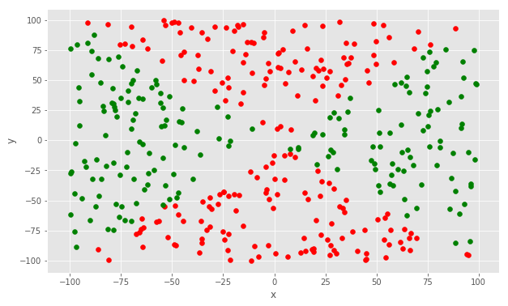


```python
regression = LogisticRegression()
regression.fit(train, train_y);
plot_data(train, train_y, regression)
```


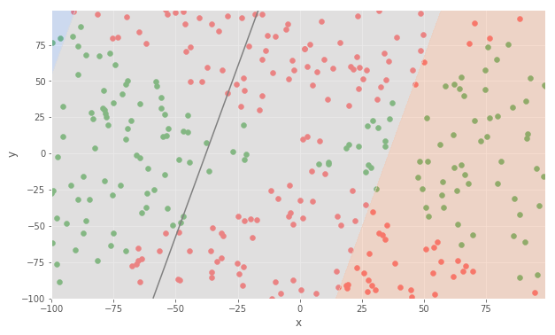


```python
train["x1^2"] = train["x1"] ** 2
train["x2^2"] = train["x2"] ** 2
```


```python
plot_data(train[["x1^2", "x2^2"]], train_y)
```


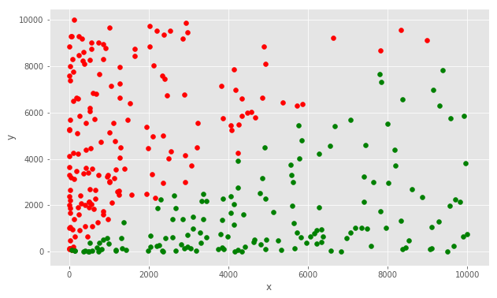


```python
new_train = train[["x1^2", "x2^2"]]
regression = LogisticRegression()
regression.fit(new_train, train_y);
plot_data(new_train, train_y, regression)
```


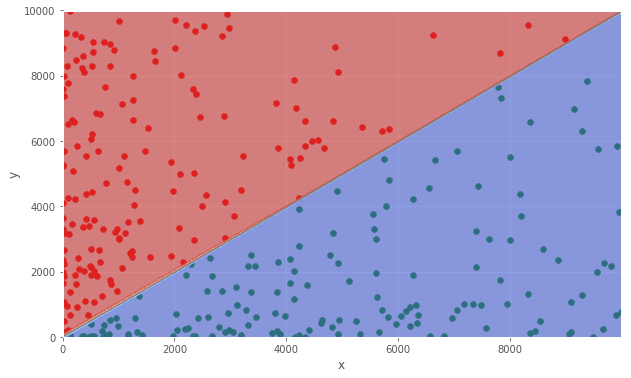


```python
train, test, train_y, test_y = train_test_split(x, y, test_size=0.2)
polynomial_features = PolynomialFeatures(degree=2)
new_test = pd.DataFrame(polynomial_features.fit_transform(test), index=test.index)
```


```python
polynomial_features = PolynomialFeatures(degree=2)
new_train = pd.DataFrame(polynomial_features.fit_transform(train), index=train.index)
new_train.columns = ['1', 'x1', 'x2', 'x1^2','x1 * x2', 'x2^2']
print(new_train.head().to_string(index=False))
```

    1    x1    x2     x1^2  x1 * x2     x2^2
    1.00 -9.98 80.72    99.50  -805.21 6,515.97
    1.00  8.80 91.16    77.50   802.55 8,311.04
    1.00 50.97 24.89 2,597.69 1,268.33   619.27
    1.00 -2.32 57.35     5.39  -133.12 3,289.03
    1.00  2.02 72.58     4.09   146.74 5,267.29


```python
regression = LogisticRegression()
regression.fit(new_train, train_y)
print(f"Testing accuracy: {accuracy_score(test_y, regression.predict(new_test)):.3f}")
```

    Testing accuracy: 1.000


```python
n = 400

def genSpiral(deltaT, label, m): 
    x1 = np.array([])
    x2 = np.array([])
    y = np.array([])
    for i in range(m):
        r = i / m * 10;
        t = 1.75 * i / m * 2 * math.pi + deltaT;
        x1 = np.append(x1, r * math.sin(t) + random()*2-1 * .03)
        x2 = np.append(x2, r * math.cos(t) + random()*2-1 * .03)
        y = np.append(y, label)  
    return x1, x2, y

x1, x2, y = genSpiral(0, 1, 200); 
x1_2, x2_2, y_2 = genSpiral(math.pi, 0, 200);

x = pd.DataFrame()

x['x1'] = np.append(x1, x1_2)
x['x2'] = np.append(x2, x2_2)
y = np.append(y, y_2)

train, test, train_y, test_y = train_test_split(x, y, test_size=0.2)

```


```python
plot_data(x, y)
```


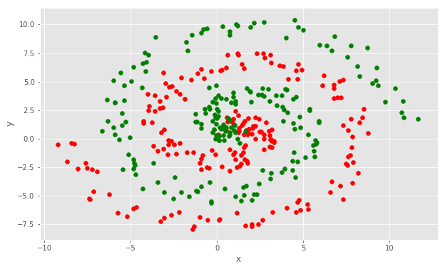


```python
regression = LogisticRegression(C=0.01)
model = Pipeline(steps=[
    ('poly', PolynomialFeatures(degree=8)),
    ('regression', regression)])
model.fit(train, train_y);
plot_data(train, train_y, model)
```


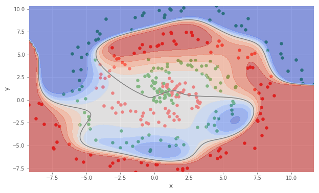


```python
print(f"Training accuracy: {accuracy_score(train_y, model.predict(train)):.3f}")
print(f"Testing accuracy: {accuracy_score(test_y, model.predict(test)):.3f}")
```

    Training accuracy: 0.650
    Testing accuracy: 0.550


### Regularization


```python
def plot_learning_curve(estimator, title, X, y, ylim=None, cv=None,
                        n_jobs=1, train_sizes=np.linspace(.1, 1.0, 5)):
    plt.figure()
    plt.title(title)
    if ylim is not None:
        plt.ylim(*ylim)
    plt.xlabel("Training examples")
    plt.ylabel("Score")
    train_sizes, train_scores, test_scores = learning_curve(
        estimator, X, y, cv=cv, n_jobs=n_jobs, train_sizes=train_sizes)
    train_scores_mean = np.mean(train_scores, axis=1)
    train_scores_std = np.std(train_scores, axis=1)
    test_scores_mean = np.mean(test_scores, axis=1)
    test_scores_std = np.std(test_scores, axis=1)
    plt.grid()

    plt.fill_between(train_sizes, train_scores_mean - train_scores_std,
                     train_scores_mean + train_scores_std, alpha=0.1,
                     color="r")
    plt.fill_between(train_sizes, test_scores_mean - test_scores_std,
                     test_scores_mean + test_scores_std, alpha=0.1, color="g")
    plt.plot(train_sizes, train_scores_mean, 'o-', color="r",
             label="Training score")
    plt.plot(train_sizes, test_scores_mean, 'o-', color="g",
             label="Cross-validation score")

    plt.legend(loc="best")
    return plt

```


```python
def true_fun(X):
    return np.cos(1.5 * np.pi * X)

def show_overfitting():
    np.random.seed(0)

    n_samples = 30
    degrees = [1, 4, 15]

    X = np.sort(np.random.rand(n_samples))
    y = true_fun(X) + np.random.randn(n_samples) * 0.1

    plt.figure(figsize=(14, 5))
    for i in range(len(degrees)):
        ax = plt.subplot(1, len(degrees), i + 1)
        plt.setp(ax, xticks=(), yticks=())

        polynomial_features = PolynomialFeatures(degree=degrees[i],
                                                 include_bias=False)
        linear_regression = LinearRegression()
        pipeline = Pipeline([("polynomial_features", polynomial_features),
                             ("linear_regression", linear_regression)])
        pipeline.fit(X[:, np.newaxis], y)

        # Evaluate the models using crossvalidation
        scores = cross_val_score(pipeline, X[:, np.newaxis], y,
                                 scoring="neg_mean_squared_error", cv=10)

        X_test = np.linspace(0, 1, 100)
        plt.plot(X_test, pipeline.predict(X_test[:, np.newaxis]), label="Model")
        plt.plot(X_test, true_fun(X_test), label="True function")
        plt.scatter(X, y, edgecolor='b', s=20, label="Samples")
        plt.xlabel("x")
        plt.ylabel("y")
        plt.xlim((0, 1))
        plt.ylim((-2, 2))
        plt.legend(loc="best")

    plt.show()
```


```python
show_overfitting()
```


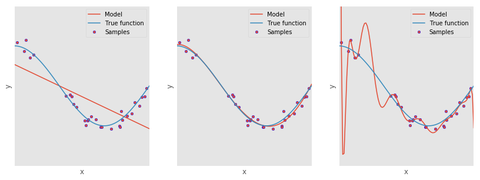


### So what is regularization?

* It's a penalty for parameters 
* Adding penalty to the cost function:
```
    Cost = MSE(y, f(w)) + 1/C * sum(w),
    where f(x) = w*x
```
* Bigger parameter - larger cost function
* Optimizator will minimize parameters


### Two main types of regularization

* L1 or `sum(|w|)` - will push parameters to zero
* L2 or `sum(w^2)` - will limit parameter growth

### Coming back to the dataset 

* Let's use L1 regularization 
* This will eliminate unuseful polynomial features


```python
train, test, train_y, test_y = train_test_split(x, y, test_size=0.2)
model = Pipeline(steps=[('poly', PolynomialFeatures(degree=8)),
                  ('linear', LogisticRegression(C=100, penalty='l1'))])
model.fit(train, train_y);
plot_data(train, train_y, model)
```


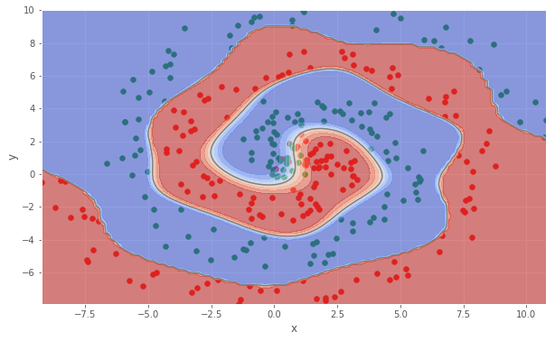


```python
print(f"Training accuracy: {accuracy_score(train_y, model.predict(train)):.3f}")
print(f"Testing accuracy: {accuracy_score(test_y, model.predict(test)):.3f}")
```

    Training accuracy: 0.978
    Testing accuracy: 0.863


```python
n = 500
x1 = np.random.rand(n) * 200 - 100
x2 = np.random.rand(n) * 200 - 100
y = x1**2 + x2**2 < 50**2
x = pd.DataFrame()
x['x1'] = x1
x['x2'] = x2

train, test, train_y, test_y = train_test_split(x, y, test_size=0.2)
```


```python
plot_data(x, y)
```


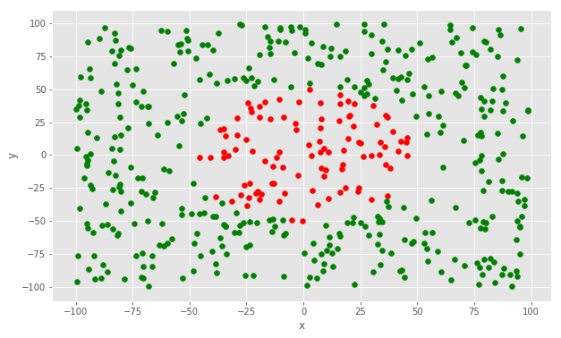


```python
# Let's use Radial basis function
# as a separate feature
gamma = 0.0005
x['gaussian'] = np.exp(- gamma * (x1**2 + x2**2))
```


```python
def plot3d(x, y, z, model=None):
    fig = plt.figure(figsize=(12,8))
    ax = fig.gca(projection='3d')
  

    surf = ax.plot_trisurf(x, y, z,  cmap=cm.coolwarm,
            linewidth=0, antialiased=True)
    #ax.set_zlim(0, 0.2)

    ax.zaxis.set_major_locator(LinearLocator(10))
    ax.zaxis.set_major_formatter(FormatStrFormatter('%.02f'))

    fig.colorbar(surf, shrink=0.5, aspect=5)
    if model:
        w = model.coef_[0]
        b = model.intercept_
        X, Y = np.meshgrid(np.arange(-100, 100, 0.25), 
                           np.arange(-100, 100, 0.25))
        Z = (w[0]*X + w[1]*Y + b) / -w[2]
        surf2 = ax.plot_surface(X, Y, Z, alpha=.3,
            linewidth=0, antialiased=True, cmap='summer')

   
    plt.show()

```


```python
plot3d(x['x1'], x['x2'], x['gaussian'])
```


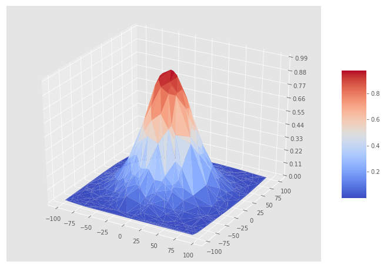


```python
train, test, train_y, test_y = train_test_split(x, y, test_size=0.2)
logistic = LogisticRegression()
logistic.fit(train, train_y);
plot3d(x['x1'], x['x2'], x['gaussian'], logistic)
```


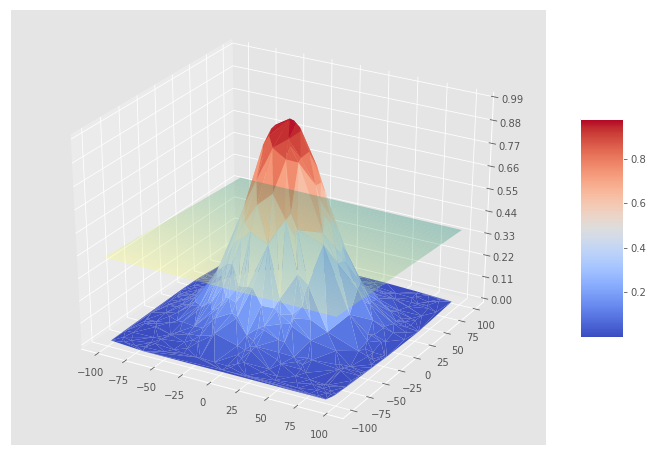


### SVM

* Linear model
* Transforms data into higher dimentions 
* More efficient than manual transform
* Optimizes margin between classes


```python
n = 500
x1 = np.random.rand(n) * 200 - 100
x2 = np.random.rand(n) * 200 - 100
y = x1**2 + x2**2 < 50**2
x = pd.DataFrame()
x['x1'] = x1
x['x2'] = x2

train, test, train_y, test_y = train_test_split(x, y, test_size=0.2)
```


```python
model = SVC(gamma=0.0001)
model.fit(train, train_y)
plot_data(train, train_y, model)
```


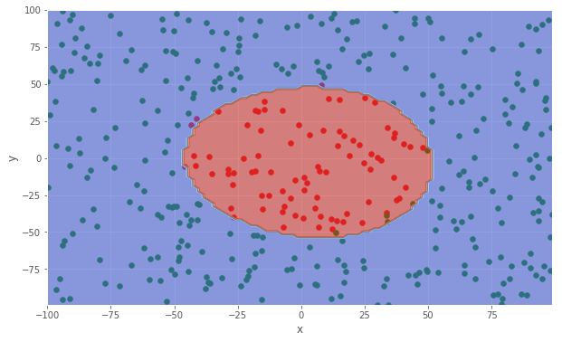


## Let's try some real problem


```python
data = pd.read_csv('data/HR_comma_sep.csv', index_col=None)
train, test = train_test_split(data, test_size=0.2)

features_used = ['average_montly_hours',
                 'satisfaction_level',
#                  'number_project',
#                  'last_evaluation',
#                  'time_spend_company',
#                  'Work_accident'
                ]

X = train[features_used]
y = train['left']

Xy = X.join(y).sample(frac=1)
```


```python
print(Xy.head().to_string(index=False))
```

    average_montly_hours  satisfaction_level  left
                     243                0.63     0
                     169                0.76     0
                     267                0.50     0
                     167                0.20     0
                     145                0.60     0


```python
sub_sample = random_sample(len(X)) > 0.95
small_X = X[sub_sample]
small_y = y[sub_sample]
```


```python
plot_data(small_X, small_y)
```


```python
class ConfidentClassifier:
    def decision_function(self, X):
        return [1.0 if x else -1.0 for x in self.predict(X)]
```


```python
class NaiveClassifier(ConfidentClassifier):
    def predict(self, X):
        amh = X['average_montly_hours']
        sl = X['satisfaction_level']
        return ((amh > 250) & (sl < .85)) | ((amh < 160) & (sl > .3) & (sl < .5))  
```


```python
def performance(model, dataset):
    # test set is 20% of all data 
    expected = dataset['left']==1
    prediction = model.predict(dataset[features_used])
    model_name = model.__class__.__name__
    print(f"Accuracy of {model_name}: {accuracy_score(expected, prediction)}")
```


```python
performance(NaiveClassifier(), test)
```

    Accuracy of NaiveClassifier: 0.8056666666666666


```python
class OptimisticHR(ConfidentClassifier):
    def predict(self, X):
        return np.zeros(len(X)) # never predicts that person leave

performance(OptimisticHR(), test)
```

    Accuracy of OptimisticHR: 0.7616666666666667


```python
class PessimisticHR(ConfidentClassifier):
    def predict(self, X):
        return np.ones(len(X)) # predicts that every person leaves
    
performance(PessimisticHR(), test)
```

    Accuracy of PessimisticHR: 0.23833333333333334


```python
class FairCoin(ConfidentClassifier):
    def predict(self, X):
        return np.random.randint(2, size=len(X))
    
performance(FairCoin(), test)
```

    Accuracy of FairCoin: 0.49866666666666665


```python
def performance(model, dataset):
    expected = dataset['left']==1
    prediction = model.predict(dataset[features_used])
    model_name = model.__class__.__name__
    print(f"Accuracy of {model_name}: {accuracy_score(expected, prediction)}")
    print(f"Classification report for {model_name}:\n {classification_report(expected, prediction)}")
```


```python
performance(NaiveClassifier(), test)
```

    Accuracy of NaiveClassifier: 0.8056666666666666
    Classification report for NaiveClassifier:
                  precision    recall  f1-score   support
    
          False       0.91      0.83      0.87      2285
           True       0.57      0.73      0.64       715
    
    avg / total       0.83      0.81      0.81      3000
    


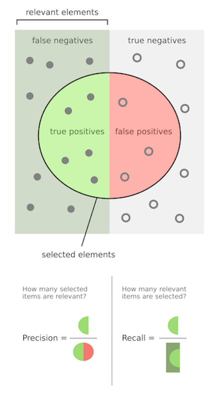

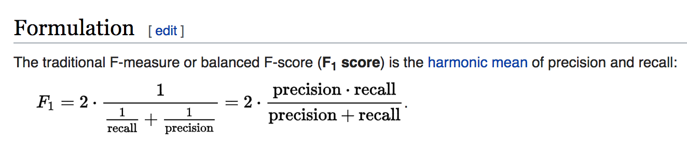


```python
performance(OptimisticHR(), test)
```

    Accuracy of OptimisticHR: 0.7616666666666667
    Classification report for OptimisticHR:
                  precision    recall  f1-score   support
    
          False       0.76      1.00      0.86      2285
           True       0.00      0.00      0.00       715
    
    avg / total       0.58      0.76      0.66      3000
    


```python
# Compute ROC curve and ROC area for each class
def plot_roc_curve(model, dataset):
    y_score = model.decision_function(dataset[features_used])
    fpr, tpr, _ = roc_curve(dataset['left'] == 1, y_score)
    roc_auc = auc(fpr, tpr)
    plt.figure()
    plt.plot(fpr, tpr, color='darkorange', lw=2, label='ROC curve (area = %0.4f)' % roc_auc)
    plt.plot([0, 1], [0, 1], color='navy', lw=2, linestyle='--')
    plt.xlim([0.0, 1.0])
    plt.ylim([0.0, 1.05])
    plt.xlabel('False Positive Rate')
    plt.ylabel('True Positive Rate')
    plt.title('Receiver operating characteristic example')
    plt.legend(loc="lower right")
    plt.show()
```

## Area under receiver operating characteristic curve (ROC curve)
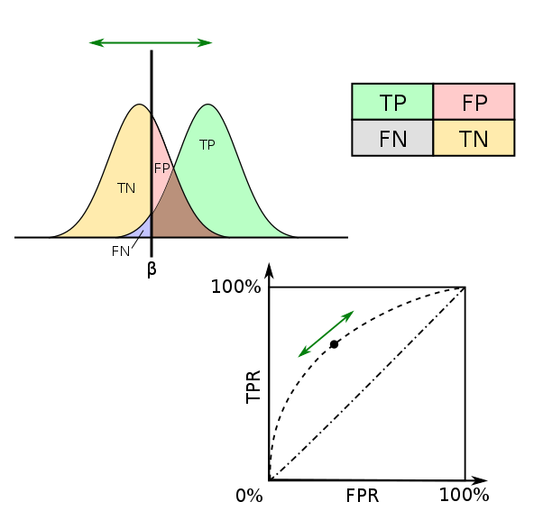


```python
plot_roc_curve(OptimisticHR(), test)
```


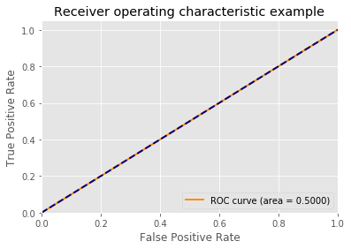


```python
plot_roc_curve(NaiveClassifier(), test)
```


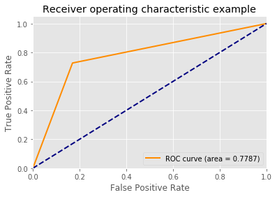


## Let's use logistic regresion


```python
regression = LogisticRegression()
regression.fit(train[features_used], train['left'])
plot_data(small_X, small_y, regression)
```


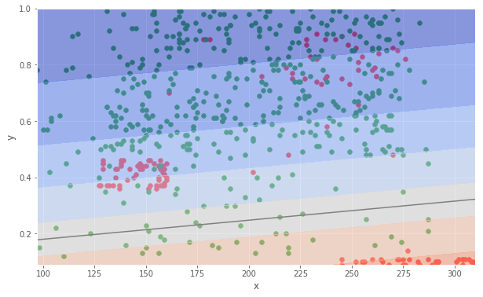


```python
performance(regression, test)
```

    Accuracy of LogisticRegression: 0.7713333333333333
    Classification report for LogisticRegression:
                  precision    recall  f1-score   support
    
          False       0.80      0.93      0.86      2285
           True       0.54      0.26      0.36       715
    
    avg / total       0.74      0.77      0.74      3000
    


```python
regression = LogisticRegression(class_weight='balanced')
regression.fit(train[features_used], train['left'])

plot_data(small_X, small_y, regression)
```


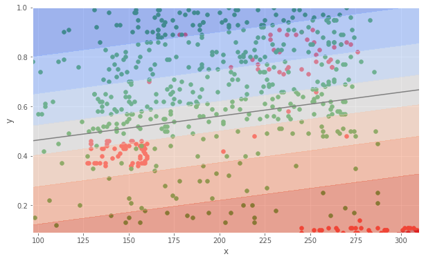


```python
performance(regression, test)
```

    Accuracy of LogisticRegression: 0.7183333333333334
    Classification report for LogisticRegression:
                  precision    recall  f1-score   support
    
          False       0.89      0.71      0.79      2285
           True       0.44      0.73      0.55       715
    
    avg / total       0.79      0.72      0.74      3000
    


```python
polynomial_features = PolynomialFeatures(degree=2)
regression = LogisticRegression(class_weight='balanced')
pipe = Pipeline(steps=[
    ('polynomial_features', polynomial_features), 
    ('regression', regression)
])
pipe.fit(train[features_used], train['left']);
```


```python
performance(pipe, test)
```

    Accuracy of Pipeline: 0.736
    Classification report for Pipeline:
                  precision    recall  f1-score   support
    
          False       0.88      0.75      0.81      2285
           True       0.46      0.69      0.55       715
    
    avg / total       0.78      0.74      0.75      3000
    


```python
plot_data(small_X, small_y, pipe)
```


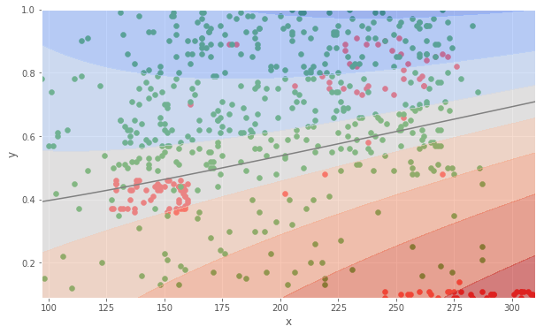


```python
# Cross-validation
fold = KFold(len(train), n_folds=5, shuffle=True)
```


```python
polynomial_features = PolynomialFeatures()
logistic = linear_model.LogisticRegression(class_weight='balanced', max_iter=10)
pipe = Pipeline(steps=[
    ('polynomial', polynomial_features), 
    ('logistic', logistic)
])
```


```python
# All possible parameters
Cs = [0.0001, 0.001, 0.01, 0.1, 1.0, 10.0, 100.0, 1000.0, 10000.0]
degrees = [2,3,4]
penalties = ['l1','l2']
```


```python
estimator = RandomizedSearchCV(
    pipe,
    scoring='roc_auc',
    cv=fold,
    n_iter=20,
    param_distributions=dict(
        polynomial__degree=degrees,
        logistic__C=Cs,
        logistic__penalty=penalties
    )
)

estimator.fit(train[features_used], train['left']);
```


```python
print(estimator.best_params_)
```

    {'polynomial__degree': 4, 'logistic__penalty': 'l1', 'logistic__C': 1000.0}


```python
performance(estimator, train)
```

    Accuracy of RandomizedSearchCV: 0.733477789815818
    Classification report for RandomizedSearchCV:
                  precision    recall  f1-score   support
    
          False       0.90      0.73      0.81      9143
           True       0.46      0.75      0.57      2856
    
    avg / total       0.80      0.73      0.75     11999
    


```python
plot_data(small_X, small_y, estimator)
```


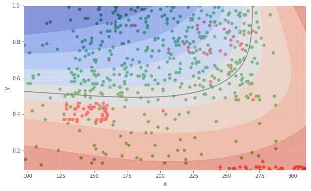


```python
plot_roc_curve(estimator, test)
```


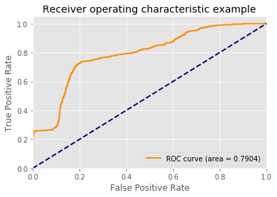


```python
clf = tree.DecisionTreeClassifier()
clf.fit(train[features_used], train['left']);
```


```python
performance(clf, test)
```

    Accuracy of DecisionTreeClassifier: 0.913
    Classification report for DecisionTreeClassifier:
                  precision    recall  f1-score   support
    
          False       0.94      0.95      0.94      2285
           True       0.82      0.81      0.82       715
    
    avg / total       0.91      0.91      0.91      3000
    


```python
plot_data(small_X, small_y, clf)
```


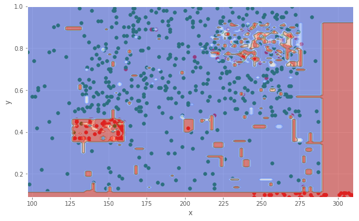


```python
performance(clf, train)
```

    Accuracy of DecisionTreeClassifier: 0.9648304025335445
    Classification report for DecisionTreeClassifier:
                  precision    recall  f1-score   support
    
          False       0.97      0.98      0.98      9143
           True       0.93      0.92      0.93      2856
    
    avg / total       0.96      0.96      0.96     11999
    


```python
clf = tree.DecisionTreeClassifier()
cv = KFold(len(train), n_folds=5, shuffle=True)
plot_learning_curve(clf, "Learning Curve", train[features_used],  train['left'], ylim=(0.7, 1.01), cv=cv);
```


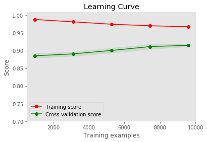


```python
clf = tree.DecisionTreeClassifier(max_depth=5)
cv = KFold(len(train), n_folds=5, shuffle=True)
plot_learning_curve(clf, "Learning Curve", train[features_used], train['left'], ylim=(0.7, 1.01), cv=cv);
```


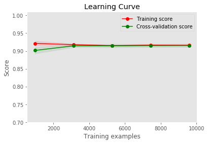


```python
clf.fit(train[features_used], train['left']);
performance(clf, train)
```

    Accuracy of DecisionTreeClassifier: 0.9159096591382615
    Classification report for DecisionTreeClassifier:
                  precision    recall  f1-score   support
    
          False       0.91      0.99      0.95      9143
           True       0.95      0.68      0.79      2856
    
    avg / total       0.92      0.92      0.91     11999
    


```python
plot_data(small_X, small_y, clf)
```


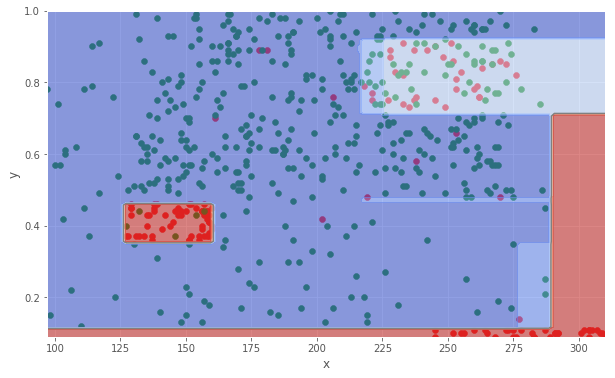


```python
dot_data = tree.export_graphviz(clf, out_file=None, 
                         feature_names=['average_montly_hours','satisfaction_level'],  
                         class_names=['Stayed', 'Left'],  
                         filled=True, rounded=True,  
                         special_characters=True)  
g = graphviz.Source(dot_data)  
g
```


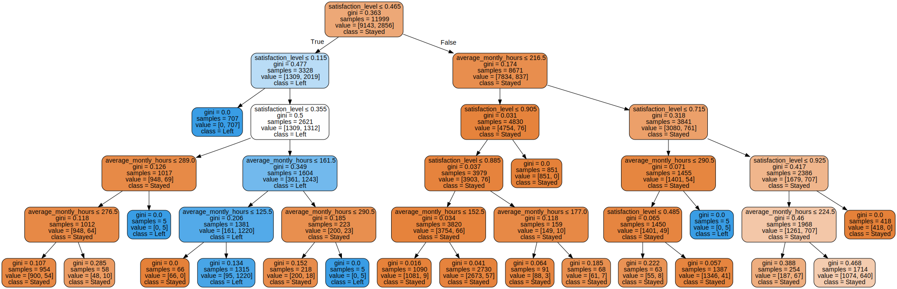


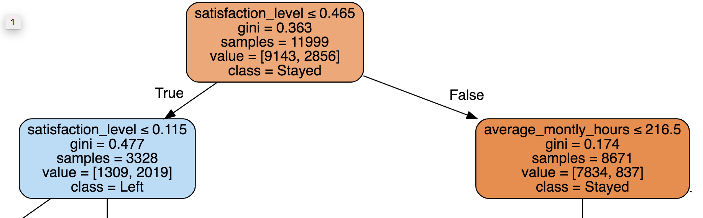

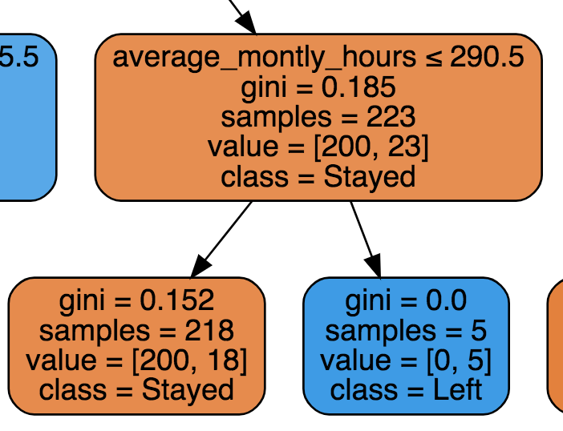


```python
train['proj_time'] = train['number_project']/train['time_spend_company']
test['proj_time'] = test['number_project']/test['time_spend_company']

features_used = ['average_montly_hours',
                 'satisfaction_level',
                 'number_project',
                 'proj_time',
                 'last_evaluation',
                 'time_spend_company',
                 'Work_accident', 
                ]

X = train[features_used]
y = train['left']

sub_sample = random_sample(len(X)) > 0.98
small_X = X[sub_sample]
small_y = y[sub_sample]

Xy = X.join(y).sample(frac=1)
```

### What about more than two dimentions?


```python
print(X.head().to_string(index=False))
```

    average_montly_hours  satisfaction_level  number_project  proj_time  last_evaluation  time_spend_company  Work_accident
                     148                0.66               5       1.67             0.67                   3              0
                     237                0.24               6       1.20             0.94                   5              0
                     181                0.80               5       1.25             0.74                   4              1
                     136                0.43               2       0.67             0.52                   3              0
                     236                0.78               5       1.67             0.59                   3              0


### Getting rid of useless features


```python
plt.figure(figsize=(6,6))
sns.heatmap(Xy.corr(), vmax=1.0, annot=True, cmap='YlGn')
plt.title('Correlation between features');
```


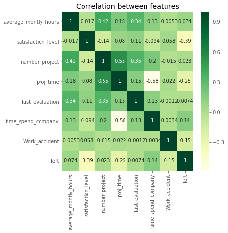


```python
clf = tree.DecisionTreeClassifier(criterion="entropy")
clf.fit(X, y);
```


```python
performance(clf, test)
```

    Accuracy of DecisionTreeClassifier: 0.9776666666666667
    Classification report for DecisionTreeClassifier:
                  precision    recall  f1-score   support
    
          False       0.99      0.98      0.99      2285
           True       0.94      0.96      0.95       715
    
    avg / total       0.98      0.98      0.98      3000
    


```python
[print(f"Importance({x}) = {y}") for x, y in zip (features_used, clf.feature_importances_)];
```

    Importance(average_montly_hours) = 0.09654514159808582
    Importance(satisfaction_level) = 0.36471495375154606
    Importance(number_project) = 0.16690494423880492
    Importance(proj_time) = 0.04877921024855973
    Importance(last_evaluation) = 0.14264567117737145
    Importance(time_spend_company) = 0.17692731239732337
    Importance(Work_accident) = 0.003482766588308622


### How to visualize


```python
scaler = StandardScaler()
pca = PCA(n_components=2)
dim_reducer = Pipeline(steps=[('scaler', scaler), ('pca', pca)])
dim_reducer.fit(X);
```


```python
transformed = pd.DataFrame(dim_reducer.transform(X), index=train.index)
sample_10perc = random_sample(len(X)) > 0.9
plot_data(transformed[sample_10perc], y[sample_10perc]);
```


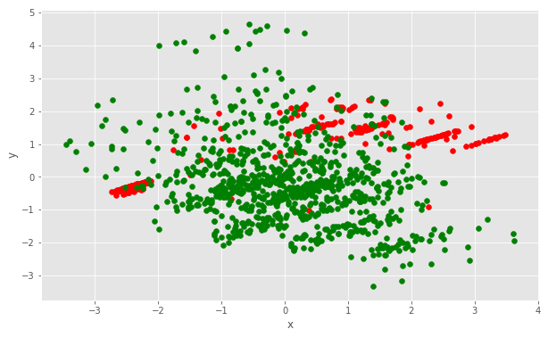


```python
polynomial_features = PolynomialFeatures(4)
logistic = linear_model.LogisticRegression(
    class_weight='balanced', 
    penalty='l1', 
    C=10, 
    max_iter=500
)
```


```python
model = Pipeline(steps=[
    ('polynomial_features', polynomial_features),
    ('logistic', logistic)
])
```


```python
pipe = Pipeline(steps=[
    ('dim_reducer', dim_reducer),
    ('model', model)])
pipe.fit(X, y);
```


```python
transformed = pd.DataFrame(dim_reducer.transform(X), index=train.index)
plot_data(transformed, y, model);
```


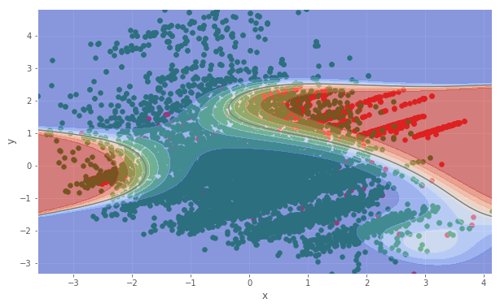


```python
performance(pipe, test)
```

    Accuracy of Pipeline: 0.9303333333333333
    Classification report for Pipeline:
                  precision    recall  f1-score   support
    
          False       0.98      0.93      0.95      2285
           True       0.81      0.92      0.86       715
    
    avg / total       0.94      0.93      0.93      3000
    


## Summary

* Know your data
* Visualize everything 
* Start from simple models
* Choose right metrics for evaluation
* Simple heristics are usually good start
